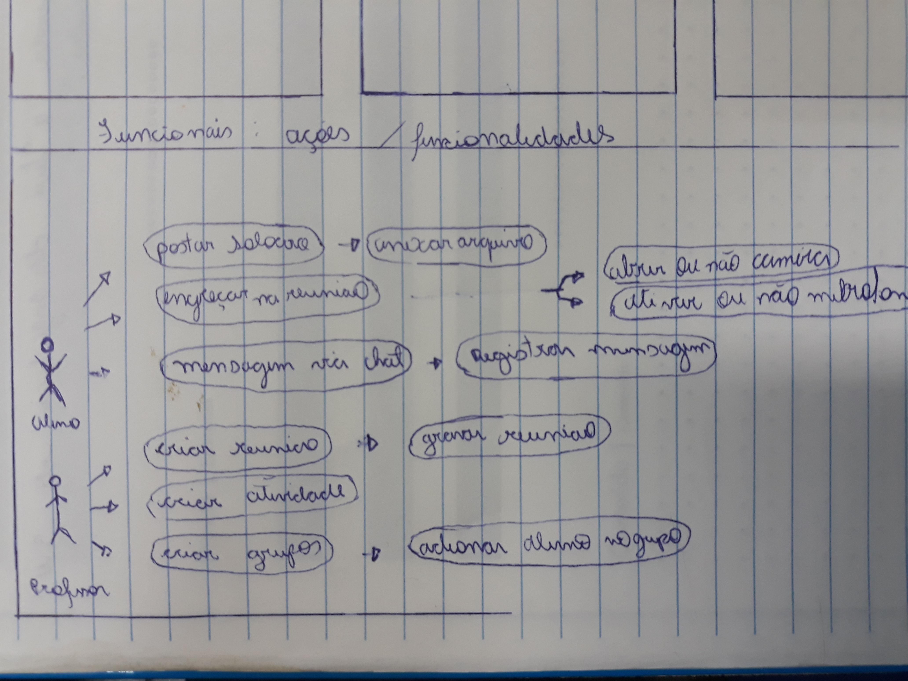

#RA e meu nome
# Eng .de Software
 Destinado para Atividade 
 

 
<<<<<<< HEAD
 ### Resequisito Funcional
 
 
 ### Resito não funcionais
=======
 

 
## caso de uso
 
### Resequisito Funcional
 
 
 
### Resito nao funcionais 10 euristicas
>>>>>>> 134a9fd2521aa390f44d357d8bf68711d56aece7
 

### Atividade 07/03/2022 Story Cards

Como aluno eu preciso postar minhas atividades no Teams, selecionado e equipe de atividade em questao , selecionado tarefas estao fazendouploud, para que consiga nots.

Como aluno eu preciso daruma atuzalização nas minhas atividades,selecionado a equipe de atividade em questão.e clicr em editar entrega na aba de tarefas.

Como professor eu preciso criar reuniões,selecionando a equipeda minha matéria, e selecionando iniciar reunião.

<<<<<<< HEAD
=======

<<<<<<< HEAD
### ciclo de vida 
=======
  ### ciclo de vida 
>>>>>>> 5c8ead2cc31a0eea175b0fe2ea08f5fcde14d429

>>>>>>> 134a9fd2521aa390f44d357d8bf68711d56aece7
